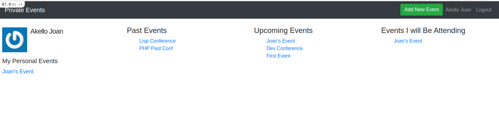

# Private Events

> A private eventbrite sample app to demonstrate rails powerful associations using Active Records.

## Built With

- Ruby v3.0.0
- Ruby on Rails v6.1.3
- Bootstrap 5

## Screen Shot

## Getting Started

To get a local copy up and running follow these simple example steps.

### Prerequisites

- Ruby on Rails v6.x. To learn how to install Ruby on Rails, please follow this [link](https://guides.rubyonrails.org/getting_started.html)

### Setup and Install

- Clone this repository using the link above (click on the 'code' button)
- open a terminal and `cd` to the cloned repository
- run `bundle install --with production` to install the dependencies
- run `rails db:migrate` to migrate the database
- run `rails db:seed` to seed the database with users that you can use to invite for events
- start a server with `rails s`

### Usage

- Sign up to login and create events and add invitees to an event.

## Authors

👤 **Emanuel Okello**

- GitHub: [oxenprogrammer](https://github.com/oxenprogrammer)
- Twitter: [@ox_emmy](https://twitter.com/ox_emmy)
- LinkedIn: [Emanuel Okello](https://www.linkedin.com/in/emanuel-okello/)

## 🤝 Contributing

Contributions, issues, and feature requests are welcome!

Feel free to check the [issues page](https://github.com/oxenprogrammer/private-events/issues).

## Show your support

Give a ⭐️ if you like this project!

## Acknowledgments

- [The Odin Project](https://www.theodinproject.com/courses/ruby-on-rails/lessons/authentication)

## 📝 License

This project is [MIT](LICENSE) licensed.